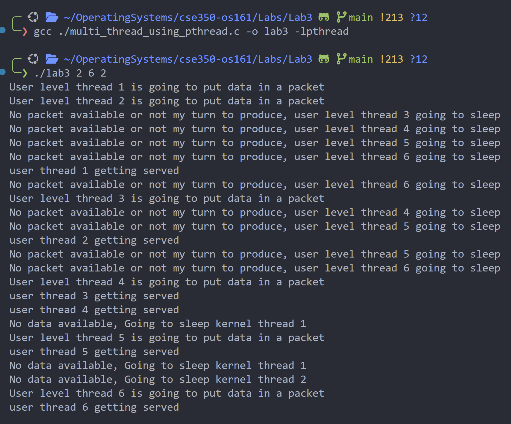
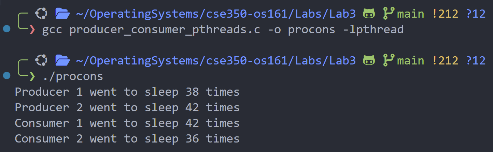
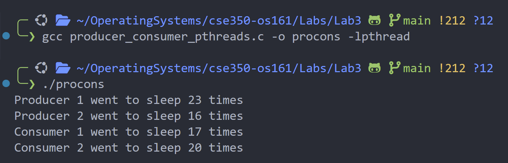
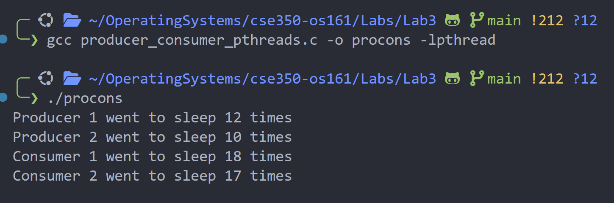

### Problem  1:

Multi Thread program using `pthread` for User and Kernel Level Threads.

**I have a total of 4 functions:** 

### `add_random_delay`  Function:

Calls the usleep for sleeping till `10000 + 1000 * (my_id * 1000 % 5)`ms specified time  as specified in given document.

### Main Function

The `main` function initializes the number of packets (`X`), user threads (`N`), and kernel threads (`M`). It creates the threads, sets up synchronization with mutexes and condition variables, and waits for all threads to finish before cleaning up resources.

- **pthread_t user_threads[N]**: Array for user threads.
- **pthread_t kernel_threads[M]**: Array for kernel threads.
- **pthread_mutex_init()**: Initializes the mutex.
- **pthread_cond_init()**: Initializes condition variables.

### User Thread Function

The `user_thread` function produces packets. Each thread waits if it's not their turn or if no packets are available. Once conditions are met, the thread produces a packet and signals the kernel threads.

- **my_id**: ID of the user thread.
- **available_packets**: Decreased when a packet is produced.
- **pthread_cond_wait()**: User thread sleeps if it’s not their turn or no packets are available.
- **pthread_cond_broadcast()**: Signals kernel threads when a packet is ready.

### Kernel Thread Function

The `kernel_thread` function consumes packets. It waits until a packet is produced and processes it. If no packets are available, it sleeps. It signals user threads to continue producing packets.

- **my_id**: ID of the kernel thread.
- **available_packets**: Increased after consuming a packet.
- **pthread_cond_wait()**: Kernel thread sleeps if no packets are available.
- **pthread_cond_broadcast()**: Signals user threads after consuming a packet.

### Synchronization

- **mutex**: Ensures safe access to shared resources.
- **user_condition_var**: Signals user threads for their turn.
- **kernel_condition_var**: Signals kernel threads when packets are available.

**Output**:

---

### Program 2:

### Main Function

The `main` function initializes the program, creates two producer and two consumer threads, and waits for them to finish. It sets up mutex and condition variables for synchronization and prints the final sleep counts for each thread.

- **pthread_t producers[2]**: IDs for the producer threads.
- **pthread_t consumers[2]**: IDs for the consumer threads.
- **pthread_mutex_init()**: Initializes the mutex.
- **pthread_cond_init()**: Initializes condition variables for producer and consumer communication.

### Producer Thread Function

The `producer` function adds items to a shared queue until 500 items are produced. If the queue is full, the producer sleeps. When space is available, it adds an item and signals consumers.

- **queue**: Shared queue where items are produced.
- **count**: Tracks the number of items in the queue.
- **items_produced**: Total number of items produced.
- **producer_sleep_count[id]**: Counts how many times the producer sleeps when the queue is full.

### Consumer Thread Function

The `consumer` function consumes items from the shared queue until 500 items are consumed. If the queue is empty, the consumer sleeps. When items are available, it removes an item and signals producers.

- **queue**: Shared queue from which items are consumed.
- **count**: Tracks the number of items in the queue.
- **items_consumed**: Total number of items consumed.
- **consumer_sleep_count[id]**: Counts how many times the consumer sleeps when the queue is empty.

### Synchronization Variables

- **mutex**: Synchronizes access to the queue.
- **cond_producer**: Signals when space is available in the queue.
- **cond_consumer**: Signals when items are available in the queue.

**Output:**

1. `Queue Size 10`:
    
    
    

1. `Queue Size 20` :
    
    
    

1. `Queue Size 30` :
    
    
